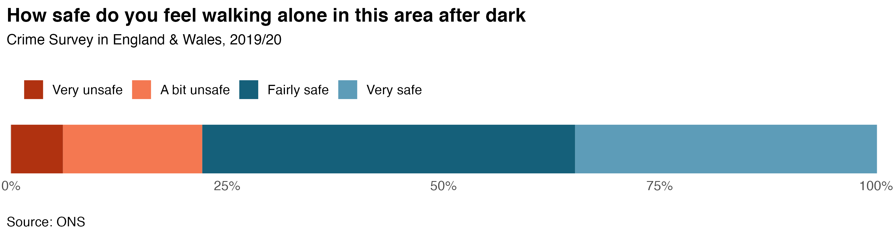

# How to explore the CSEW in R {.toc-ignore}
 
```{r setup, include = FALSE}
knitr::opts_chunk$set(echo = TRUE, cache = TRUE, prompt = FALSE, tidy = TRUE, comment = NA, message = FALSE, warning = FALSE)

library(tidyverse) ; library(knitr)
```

<br />

### Background
The [Crime Survey for England and Wales](https://www.ons.gov.uk/peoplepopulationandcommunity/crimeandjustice/methodologies/userguidetocrimestatisticsforenglandandwales) (CSEW, formerly British Crime Survey) asks people about their experiences of victimisation over the previous 12 months, worries about crime, attitudes to the police, and crime prevention. The survey has been running since 1981 with around 35,000 people aged 16 years and over interviewed. A smaller sample of respondents aged 10 to 15 years have been interviewed since 2009/10. Respondent answers to questions about victimisation are contained in the Victim Form (VF) and those relating to attitudes to the police and the CJS, crime prevention etc are in the Non-victim Form (NVF). The survey is normally conducted face-to-face but since March 2020 it has been conducted over the telephone (TCSEW).

### Download the data
The survey data are available to download from the [UK Data Service](https://beta.ukdataservice.ac.uk/datacatalogue/series/series?id=200009). To access the data you need to create an account and assign the dataset to a research project. The latest available survey to download covers [2019/20](https://beta.ukdataservice.ac.uk/datacatalogue/studies/study?id=8812#!/details) and can be downloaded in formats suitable for SPSS, Stata and SAS. We'll use the dataset stored as `.sav` which is readable by SPSS statistical software. Download the dataset to your computer and unzip the folder. Alongside the technical report and questionnaires you'll find four different datasets in the *UKDA-8812-spss/spss/spss25* folder:

```{r, echo = FALSE}
tribble(
  ~File, ~Description,
  "csew_apr19mar20_vf", "Adults Victim Form Data",
  "csew_apr19mar20_nvf", "Adults Non-victim Form Data",
  "csew_apr19mar20_10-15_vf", "Children Victim Form Data",
  "csew_apr19mar20_10-15_nvf", "Children Non-victim Form Data"
  ) %>% kable()
```

We are going to analyse responses contained in the `csew_apr19mar20_nvf` file.

### Read the data
To read an SPSS file into R we use the `read_sav()` function from the [haven](https://haven.tidyverse.org/) package. We’ll set `user_na = TRUE` to ensure that responses such as "Don’t know" or "Refused" aren’t automatically converted to missing values. SPSS files typically include value labels for variable values e.g. 1 = "Strongly agree", 2 = "Tend to agree", 3 = "Neither agree nor disagree" etc. To use the value labels in our analysis instead of the numeric values we need to convert the labelled variables to factors using the `as_factor()` function.

```{r}
library(haven)
csew <- read_sav("data/UKDA-8812-spss/spss/spss25/csew_apr19mar20_nvf.sav", user_na = TRUE) %>%
  as_factor()
```

### Inspect the data
```{r}
dim(csew)
```

There are 33,734 observations or responses and 2,290 variables. If we download and unzip the [data dictionary](https://doc.ukdataservice.ac.uk/doc/8812/mrdoc/ukda_data_dictionaries.zip) we can find information about all of these variables. We are interested in a variable named `walkdark` which measures feelings of safety when walking alone in the dark.

We can first check all possible values that the `polatt6b` variable can take.
```{r}
levels(csew$walkdark)
```

Then, let's create a frequency table.
```{r}
table(csew$walkdark)
```

### Recoding data
There are two responses that aren't very useful so we will combine them into a single variable called 'No response' using the `fct_recode()` function from the [forcats](https://forcats.tidyverse.org) package. 

```{r}
csew <- csew %>% 
  mutate(walkdark = fct_recode(walkdark, "No response" = "Refused", "No response" = "Don't know")) 
table(csew$walkdark)
```

Next, we'll just filter out non-responses from the dataset and drop the unused factor level. 

```{r}
csew <- filter(csew, !(walkdark %in% "No response")) %>% 
  droplevels()
levels(csew$walkdark)
```

### Missing values
Missing values are represented as NA in R. To count the number of missing values in the `walkdark` variable we can use:

```{r}
sum(is.na(csew$walkdark))
```

To show missing values in a frequency table we can use the argument `useNA` and set it to 'always'.

```{r}
table(csew$walkdark, useNA = "always")
```

To exclude missing values from our analysis you can use the `na.rm = TRUE` argument or completely remove them with the `drop_na()` function from the [tidyr](https://tidyr.tidyverse.org/index.html) package.

### Weighting data
Weighting data allows us to present the analysis as being representative of the population rather than just the sample. We will use the [survey](https://cran.r-project.org/web/packages/survey/index.html) package to weight our survey data and thereby create population estimates.

```{r}
library(survey)
csew_weighted <- svydesign(data = csew, id = ~1, nest = TRUE, weights = ~C11IndivWgt)
```

### Univariate analysis
Let's create a frequency table using the weighted data and calculate the percentages for each category of the factor `walkdark`.
```{r}
round(prop.table(svytable(~walkdark,csew_weighted))*100,1)
```

Then create a stacked bar chart to visualise the results.
```{r, eval=FALSE}
ggplot(as.data.frame(round(prop.table(svytable(~walkdark,csew_weighted))*100,1)), 
       aes(x = "", y = Freq, fill = walkdark)) + 
  geom_col(width = .25) + 
  scale_x_discrete(expand = c(0.005, 0.005)) +
  scale_y_continuous(expand = c(0.005, 0.005), labels = function(x){ paste0(x, "%") }) +
  scale_fill_manual(values = c("#5d9cb8", "#15607a", "#f47851", "#b03210"),
                    guide = guide_legend(reverse = TRUE)) + 
  labs(x = NULL, y = NULL, 
       title = "How safe do you feel walking alone in this area after dark",
       subtitle = "Crime Survey in England & Wales, 2019/20",
       caption = "Source: ONS",
       fill = NULL) +
  coord_flip() +
  theme_minimal(base_size = 14) +
  theme(
    plot.margin = unit(c(4,0.1,4,0), "null"),
    panel.grid.major.y = element_blank(),
    panel.grid.minor = element_blank(),
    plot.title = element_text(size = 16, face = "bold"),
    plot.subtitle = element_text(size = 12, margin = margin(b = 20)),
    plot.caption = element_text(hjust = 0, margin = margin(t = 20)),
    legend.position = "top",
    legend.justification = "left"
    )
```

```{r, echo=FALSE, fig.width=10, fig.fullwidth=TRUE}

```

### Bivariate analysis
To explore the factors that affect feelings of safety we could look at `sex` and create a weighted contingency table.
```{r}
round(prop.table(svytable(~walkdark+sex, csew_weighted),2)*100,1)
```

We can visualise the results as a grouped column chart.
```{r, fig.width=10, fig.fullwidth=TRUE}
barplot(prop.table(svytable(~sex+walkdark, csew_weighted),1)*100, 
        beside = T,
        col = c("#2CC3AB","#875FF8"),
        main = "How safe do you feel walking alone in this area after dark (%)",
        legend.text = c("Male", "Female"),
        args.legend = list(x = 12, y = 40, cex = 1),
        ylim = c(0,50))
```

Next we can use a Mann-Whitney test to determine whether there is a statistically significant difference between `sex` and feelings of safety after dark.

```{r}
svyranktest(~walkdark + sex, design = csew_weighted, test = "wilcoxon", na.rm = TRUE)
```
