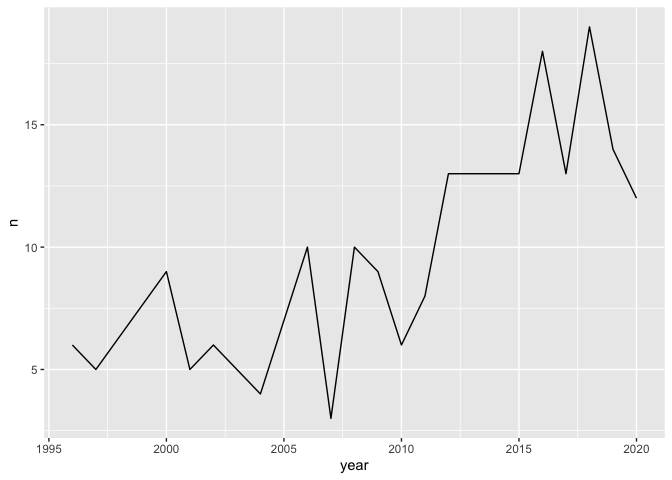

An intro to R for data journalism
================
henrypartridge
2022-09-02

## Learning objectives

-   gain familiarity with the RStudio IDE  
-   know how to load data  
-   understand some dplyr functions  
-   create simple data visualisations with ggplot2

## Data

We’ll be exploring the [Baby names in England and Wales: from
1996](https://www.ons.gov.uk/peoplepopulationandcommunity/birthsdeathsandmarriages/livebirths/datasets/babynamesinenglandandwalesfrom1996)
dataset published by the Office for National Statistics.

## Setup

If you haven’t set up RStudio on your ONS computer check out these
[instructions](https://officenationalstatistics.sharepoint.com/:w:/r/sites/MTHIT/_layouts/15/Doc.aspx?sourcedoc=%7B63CEC66C-C810-451D-B2C5-37560E16A42C%7D&file=R_Setup_Instructions_2019.docx&action=default&mobileredirect=true&DefaultItemOpen=1&cid=f002a8e4-3998-4bc2-b2e6-b7bdee409585).

**set the working directory**

-   `getwd()`

-   `setwd()`

**install packages**

-   `install.packages()`

**load packages**

-   `library()`

``` r
library(tidyverse) ; library(readxl)
```

## Read data

**from a folder**

-   `read_excel()`

``` r
#df <- read_excel("data/babynames1996to2020.xls", sheet = "Boys")
```

-   `read_csv()`

``` r
#df <- read_csv("data/babynames1996to2020.csv")
```

**from a URL**

``` r
df <- read_csv("https://raw.githubusercontent.com/rcatlord/ddj/main/data/babynames1996to2020.csv")
```

    ## 
    ## ── Column specification ─────────────────────────────────────────────────────────────
    ## cols(
    ##   year = col_double(),
    ##   sex = col_character(),
    ##   name = col_character(),
    ##   n = col_double(),
    ##   rank = col_double()
    ## )

**by hand**

-   `tribble()`

``` r
#df <- tribble(
#  ~year, ~sex, ~name, ~n, ~rank,
#  2020, "M", "Oliver", 4225, 1,
#  2020, "F", "Olivia", 3640, 1
#)
```

## Inspect data

-   `glimpse()`

``` r
glimpse(df)
```

    ## Rows: 294,798
    ## Columns: 5
    ## $ year <dbl> 1996, 1996, 1996, 1996, 1996, 1996, 1996, 1996, 1996, 1996, 1996, 1996…
    ## $ sex  <chr> "M", "M", "M", "M", "M", "M", "M", "M", "M", "M", "M", "M", "M", "M", …
    ## $ name <chr> "Jack", "Daniel", "Thomas", "James", "Joshua", "Matthew", "Ryan", "Jos…
    ## $ n    <dbl> 10779, 10338, 9603, 9385, 7887, 7426, 6496, 6193, 6161, 5802, 5750, 56…
    ## $ rank <dbl> 1, 2, 3, 4, 5, 6, 7, 8, 9, 10, 11, 12, 13, 14, 15, 16, 17, 18, 19, 20,…

-   `slice()`

``` r
slice(df, 1:10)
```

    ## # A tibble: 10 × 5
    ##     year sex   name        n  rank
    ##    <dbl> <chr> <chr>   <dbl> <dbl>
    ##  1  1996 M     Jack    10779     1
    ##  2  1996 M     Daniel  10338     2
    ##  3  1996 M     Thomas   9603     3
    ##  4  1996 M     James    9385     4
    ##  5  1996 M     Joshua   7887     5
    ##  6  1996 M     Matthew  7426     6
    ##  7  1996 M     Ryan     6496     7
    ##  8  1996 M     Joseph   6193     8
    ##  9  1996 M     Samuel   6161     9
    ## 10  1996 M     Liam     5802    10

-   `slice_max()`

``` r
slice_max(df, n, n = 5)
```

    ## # A tibble: 5 × 5
    ##    year sex   name       n  rank
    ##   <dbl> <chr> <chr>  <dbl> <dbl>
    ## 1  1996 M     Jack   10779     1
    ## 2  1996 M     Daniel 10338     2
    ## 3  1997 M     Jack   10145     1
    ## 4  1997 M     James   9853     2
    ## 5  1998 M     Jack    9845     1

## Explore data

**manipulating columns**

-   `select()`

``` r
select(df, year, sex, rank)
```

    ## # A tibble: 294,798 × 3
    ##     year sex    rank
    ##    <dbl> <chr> <dbl>
    ##  1  1996 M         1
    ##  2  1996 M         2
    ##  3  1996 M         3
    ##  4  1996 M         4
    ##  5  1996 M         5
    ##  6  1996 M         6
    ##  7  1996 M         7
    ##  8  1996 M         8
    ##  9  1996 M         9
    ## 10  1996 M        10
    ## # … with 294,788 more rows

``` r
select(df, Year = year, Sex = sex, Rank = rank)
```

    ## # A tibble: 294,798 × 3
    ##     Year Sex    Rank
    ##    <dbl> <chr> <dbl>
    ##  1  1996 M         1
    ##  2  1996 M         2
    ##  3  1996 M         3
    ##  4  1996 M         4
    ##  5  1996 M         5
    ##  6  1996 M         6
    ##  7  1996 M         7
    ##  8  1996 M         8
    ##  9  1996 M         9
    ## 10  1996 M        10
    ## # … with 294,788 more rows

``` r
select(df, rank, sex, n)
```

    ## # A tibble: 294,798 × 3
    ##     rank sex       n
    ##    <dbl> <chr> <dbl>
    ##  1     1 M     10779
    ##  2     2 M     10338
    ##  3     3 M      9603
    ##  4     4 M      9385
    ##  5     5 M      7887
    ##  6     6 M      7426
    ##  7     7 M      6496
    ##  8     8 M      6193
    ##  9     9 M      6161
    ## 10    10 M      5802
    ## # … with 294,788 more rows

-   `mutate()`

``` r
mutate(df, name_length = str_length(name))   
```

    ## # A tibble: 294,798 × 6
    ##     year sex   name        n  rank name_length
    ##    <dbl> <chr> <chr>   <dbl> <dbl>       <int>
    ##  1  1996 M     Jack    10779     1           4
    ##  2  1996 M     Daniel  10338     2           6
    ##  3  1996 M     Thomas   9603     3           6
    ##  4  1996 M     James    9385     4           5
    ##  5  1996 M     Joshua   7887     5           6
    ##  6  1996 M     Matthew  7426     6           7
    ##  7  1996 M     Ryan     6496     7           4
    ##  8  1996 M     Joseph   6193     8           6
    ##  9  1996 M     Samuel   6161     9           6
    ## 10  1996 M     Liam     5802    10           4
    ## # … with 294,788 more rows

**manipulating rows**

-   `arrange()`

``` r
arrange(df, n)
```

    ## # A tibble: 294,798 × 5
    ##     year sex   name          n  rank
    ##    <dbl> <chr> <chr>     <dbl> <dbl>
    ##  1  1996 M     Aaman         3  2863
    ##  2  1996 M     Aarif         3  2863
    ##  3  1996 M     Aayush        3  2863
    ##  4  1996 M     Abanoub       3  2863
    ##  5  1996 M     Abass         3  2863
    ##  6  1996 M     Abayomi       3  2863
    ##  7  1996 M     Abdifatah     3  2863
    ##  8  1996 M     Abdimalik     3  2863
    ##  9  1996 M     Abdiwali      3  2863
    ## 10  1996 M     Abdoulie      3  2863
    ## # … with 294,788 more rows

``` r
arrange(df, desc(n))
```

    ## # A tibble: 294,798 × 5
    ##     year sex   name       n  rank
    ##    <dbl> <chr> <chr>  <dbl> <dbl>
    ##  1  1996 M     Jack   10779     1
    ##  2  1996 M     Daniel 10338     2
    ##  3  1997 M     Jack   10145     1
    ##  4  1997 M     James   9853     2
    ##  5  1998 M     Jack    9845     1
    ##  6  1999 M     Jack    9785     1
    ##  7  1998 F     Chloe   9628     1
    ##  8  1996 M     Thomas  9603     3
    ##  9  1997 M     Thomas  9479     3
    ## 10  1998 M     Thomas  9468     2
    ## # … with 294,788 more rows

-   `filter()`

``` r
filter(df, name == "Thor")
```

    ## # A tibble: 23 × 5
    ##     year sex   name      n  rank
    ##    <dbl> <chr> <chr> <dbl> <dbl>
    ##  1  1996 M     Thor      6  1765
    ##  2  1997 M     Thor      5  2022
    ##  3  2000 M     Thor      9  1425
    ##  4  2001 M     Thor      5  2220
    ##  5  2002 M     Thor      6  2005
    ##  6  2003 M     Thor      5  2470
    ##  7  2004 M     Thor      4  3009
    ##  8  2005 M     Thor      7  2174
    ##  9  2006 M     Thor     10  1744
    ## 10  2007 M     Thor      3  4333
    ## # … with 13 more rows

``` r
filter(df, name == "Thor" & year == 2020)
```

    ## # A tibble: 1 × 5
    ##    year sex   name      n  rank
    ##   <dbl> <chr> <chr> <dbl> <dbl>
    ## 1  2020 M     Thor     12  1825

``` r
filter(df, name %in% c("Thor", "Odin"))
```

    ## # A tibble: 48 × 5
    ##     year sex   name      n  rank
    ##    <dbl> <chr> <chr> <dbl> <dbl>
    ##  1  1996 M     Thor      6  1765
    ##  2  1996 M     Odin      5  2020
    ##  3  1997 M     Thor      5  2022
    ##  4  1997 M     Odin      3  2859
    ##  5  1998 M     Odin      3  2901
    ##  6  1999 M     Odin      6  1850
    ##  7  2000 M     Thor      9  1425
    ##  8  2000 M     Odin      5  2142
    ##  9  2001 M     Thor      5  2220
    ## 10  2001 M     Odin      3  3134
    ## # … with 38 more rows

**summarising data**

-   `group_by()`

``` r
df %>% 
  group_by(year) %>% 
  top_n(1, n)
```

    ## # A tibble: 25 × 5
    ## # Groups:   year [25]
    ##     year sex   name      n  rank
    ##    <dbl> <chr> <chr> <dbl> <dbl>
    ##  1  1996 M     Jack  10779     1
    ##  2  1997 M     Jack  10145     1
    ##  3  1998 M     Jack   9845     1
    ##  4  1999 M     Jack   9785     1
    ##  5  2000 M     Jack   9079     1
    ##  6  2001 M     Jack   9000     1
    ##  7  2002 M     Jack   9100     1
    ##  8  2003 M     Jack   9037     1
    ##  9  2004 M     Jack   8380     1
    ## 10  2005 M     Jack   7434     1
    ## # … with 15 more rows

``` r
df %>% 
  group_by(year, sex) %>% 
  top_n(1, n)
```

    ## # A tibble: 50 × 5
    ## # Groups:   year, sex [50]
    ##     year sex   name      n  rank
    ##    <dbl> <chr> <chr> <dbl> <dbl>
    ##  1  1996 M     Jack  10779     1
    ##  2  1997 M     Jack  10145     1
    ##  3  1998 M     Jack   9845     1
    ##  4  1999 M     Jack   9785     1
    ##  5  2000 M     Jack   9079     1
    ##  6  2001 M     Jack   9000     1
    ##  7  2002 M     Jack   9100     1
    ##  8  2003 M     Jack   9037     1
    ##  9  2004 M     Jack   8380     1
    ## 10  2005 M     Jack   7434     1
    ## # … with 40 more rows

## Visualise data

-   `geom_line()`

``` r
df_sub <- filter(df, name == "Thor")

ggplot(df_sub, aes(x = year, y = n)) +
  geom_line()
```

<!-- -->

``` r
df_sub <- filter(df, name %in% c("Thor", "Odin"))

ggplot(df_sub, aes(x = year, y = n, colour = name)) +
  geom_line(size = 1.5) +
  facet_wrap(~name)
```

<!-- -->

## Share data

-   `ggsave()`

``` r
#ggsave("outputs/plot.png", scale = 1, dpi = 300)
```

-   `write_csv()`

``` r
#write_csv(df_sub, "outputs/names.csv")
```

## Further resources

**Beginners**  
- [RStudio primers](https://rstudio.cloud/learn/primers)  
- [R for Data Science](https://r4ds.had.co.nz/) by Hadley Wickham and
Garrett Grolemund

**Data visualisation**  
- [Fundamentals of Data Visualization](https://clauswilke.com/dataviz)
by Claus Wilke  
- [Data Visualization: A practical introduction](http://socviz.co/) by
Kieran Healy  
- [BBC Visual and Data Journalism cookbook for R
graphics](https://bbc.github.io/rcookbook)

**Statistics**  
- [Discovering Statistics Using
R](https://us.sagepub.com/en-us/nam/discovering-statistics-using-r-and-rstudio/book261351)
by Andy Field  
- [Statistics: An Introduction Using
R](https://www.wiley.com/en-gb/Statistics%3A+An+Introduction+Using+R%2C+2nd+Edition-p-9781118941096)
by Michael J. Crawley

**Help**  
- [StackOverflow](https://stackoverflow.com/questions/tagged/r)  
- [RStudio Community](https://community.rstudio.com)  
- [Twitter \#rstats hashtag](https://twitter.com/search?q=%23rstats)
