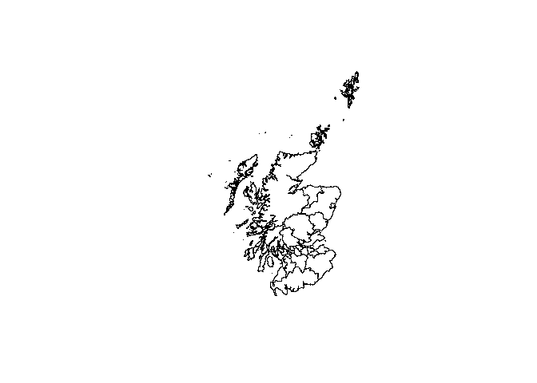

Spatial analysis
================

## Learning objectives

-   able to load and write geospatial data
-   able to plot geospatial data
-   familiar with spatial filtering, joins etc

## Data

We’ll be using digital vector boundaries of the UK’s local authority
districts and blue plaque point data

## Setup

``` r
library(tidyverse)
library(sf)
```

## Read data

Local authority Districts 
Source: ONS Open Geography Portal 
URL: https://geoportal.statistics.gov.uk/datasets/ons>::local-authority-districts-december-2021-gb-bgc-1

Load GeoJSON / ESRI Shapefile

``` r
sf <- st_read("data/Local_Authority_Districts_(December_2021)_GB_BGC.geojson")
```

    ## Reading layer `Local_Authority_Districts_(December_2021)_GB_BGC' from data source `C:\Users\partrh\Downloads\data\Local_Authority_Districts_(December_2021)_GB_BGC.geojson' 
    ##   using driver `GeoJSON'
    ## Simple feature collection with 363 features and 11 fields
    ## Geometry type: MULTIPOLYGON
    ## Dimension:     XY
    ## Bounding box:  xmin: -8.649996 ymin: 49.86479 xmax: 1.763706 ymax: 60.86078
    ## Geodetic CRS:  WGS 84

## Inspect data

``` r
glimpse(sf) 
```

    ## Rows: 363
    ## Columns: 12
    ## $ OBJECTID      [3m[38;5;246m<int>[39m[23m 1, 2, 3, 4, 5, 6, 7, 8, 9, 10, 11, 12, 13, ~
    ## $ LAD21CD       [3m[38;5;246m<chr>[39m[23m "E06000001", "E06000002", "E06000003", "E06~
    ## $ LAD21NM       [3m[38;5;246m<chr>[39m[23m "Hartlepool", "Middlesbrough", "Redcar and ~
    ## $ LAD21NMW      [3m[38;5;246m<chr>[39m[23m " ", " ", " ", " ", " ", " ", " ", " ", " "~
    ## $ BNG_E         [3m[38;5;246m<int>[39m[23m 447160, 451141, 464361, 444940, 428029, 354~
    ## $ BNG_N         [3m[38;5;246m<int>[39m[23m 531474, 516887, 519597, 518183, 515648, 382~
    ## $ LONG          [3m[38;5;246m<dbl>[39m[23m -1.27018, -1.21099, -1.00608, -1.30664, -1.~
    ## $ LAT           [3m[38;5;246m<dbl>[39m[23m 54.67614, 54.54467, 54.56752, 54.55691, 54.~
    ## $ GlobalID      [3m[38;5;246m<chr>[39m[23m "a0067727-6c25-4d75-bbe3-839cf676a069", "44~
    ## $ Shape__Area   [3m[38;5;246m<dbl>[39m[23m 93771495, 53858569, 245142932, 204902304, 1~
    ## $ Shape__Length [3m[38;5;246m<dbl>[39m[23m 68370.93, 43639.80, 94929.16, 117933.77, 10~
    ## $ geometry      [3m[38;5;246m<MULTIPOLYGON [°]>[39m[23m MULTIPOLYGON (((-1.224718 5...~

``` r
plot(sf$geometry)
```

<!-- -->

## Export data

e.g. export to GeoJSON file format

``` r
# st_write(sf, "data/Local_Authority_Districts_(December_2021)_GB_BGC.geojson")
```

## Change coordinate reference system (CRS)

``` r
st_crs(sf)
```

    ## Coordinate Reference System:
    ##   User input: WGS 84 
    ##   wkt:
    ## GEOGCRS["WGS 84",
    ##     DATUM["World Geodetic System 1984",
    ##         ELLIPSOID["WGS 84",6378137,298.257223563,
    ##             LENGTHUNIT["metre",1]]],
    ##     PRIMEM["Greenwich",0,
    ##         ANGLEUNIT["degree",0.0174532925199433]],
    ##     CS[ellipsoidal,2],
    ##         AXIS["geodetic latitude (Lat)",north,
    ##             ORDER[1],
    ##             ANGLEUNIT["degree",0.0174532925199433]],
    ##         AXIS["geodetic longitude (Lon)",east,
    ##             ORDER[2],
    ##             ANGLEUNIT["degree",0.0174532925199433]],
    ##     ID["EPSG",4326]]

``` r
sf_crs <- st_transform(sf, crs = 27700) # projected CRS
st_crs(sf_crs)
```

    ## Coordinate Reference System:
    ##   User input: EPSG:27700 
    ##   wkt:
    ## PROJCRS["OSGB 1936 / British National Grid",
    ##     BASEGEOGCRS["OSGB 1936",
    ##         DATUM["OSGB 1936",
    ##             ELLIPSOID["Airy 1830",6377563.396,299.3249646,
    ##                 LENGTHUNIT["metre",1]]],
    ##         PRIMEM["Greenwich",0,
    ##             ANGLEUNIT["degree",0.0174532925199433]],
    ##         ID["EPSG",4277]],
    ##     CONVERSION["British National Grid",
    ##         METHOD["Transverse Mercator",
    ##             ID["EPSG",9807]],
    ##         PARAMETER["Latitude of natural origin",49,
    ##             ANGLEUNIT["degree",0.0174532925199433],
    ##             ID["EPSG",8801]],
    ##         PARAMETER["Longitude of natural origin",-2,
    ##             ANGLEUNIT["degree",0.0174532925199433],
    ##             ID["EPSG",8802]],
    ##         PARAMETER["Scale factor at natural origin",0.9996012717,
    ##             SCALEUNIT["unity",1],
    ##             ID["EPSG",8805]],
    ##         PARAMETER["False easting",400000,
    ##             LENGTHUNIT["metre",1],
    ##             ID["EPSG",8806]],
    ##         PARAMETER["False northing",-100000,
    ##             LENGTHUNIT["metre",1],
    ##             ID["EPSG",8807]]],
    ##     CS[Cartesian,2],
    ##         AXIS["(E)",east,
    ##             ORDER[1],
    ##             LENGTHUNIT["metre",1]],
    ##         AXIS["(N)",north,
    ##             ORDER[2],
    ##             LENGTHUNIT["metre",1]],
    ##     USAGE[
    ##         SCOPE["Engineering survey, topographic mapping."],
    ##         AREA["United Kingdom (UK) - offshore to boundary of UKCS within 49°45'N to 61°N and 9°W to 2°E; onshore Great Britain (England, Wales and Scotland). Isle of Man onshore."],
    ##         BBOX[49.75,-9,61.01,2.01]],
    ##     ID["EPSG",27700]]

## Edit attribute data

``` r
sf_crs <- select(sf_crs, AREACD = LAD21CD, AREANM = LAD21NM)
```

## Filter features

``` r
ew <- sf_crs %>% 
  filter(!str_detect(AREACD, "^S"))
plot(st_geometry(ew))
```

<!-- -->

## Dissolve features

``` r
s <- sf_crs %>% 
  filter(str_detect(AREACD, "^S")) %>% 
  st_union()
plot(st_geometry(s))
```

<!-- -->

## Buffer features

``` r
m <- sf_crs %>% 
  filter(AREANM == "Manchester")
buffer <- st_buffer(m, 1000) # 1km also minus
plot(m$geometry)
plot(buffer$geometry, add = T, border = "red")
```

<!-- -->

## Simplify features

Douglas-Peucker algorithm

``` r
m_simp = st_simplify(m, dTolerance = 500)  # 500 m
plot(m$geometry)
plot(m_simp$geometry, add = T, border = "red")
```

<!-- -->

Visvalingam algorithm

``` r
library(rmapshaper)
m_simp <- ms_simplify(m, keep = 0.1, keep_shapes = TRUE) # keep 10% of vertices
plot(m$geometry)
plot(m_simp$geometry, add = T, border = "red")
```

<!-- -->

## Centroids

Geographic centroid

``` r
hackney <- filter(sf_crs, AREANM == "Hackney")
hackney_centroid <- st_centroid(hackney)
```

    ## Warning: st_centroid assumes attributes are constant over
    ## geometries

``` r
plot(hackney$geometry)
plot(hackney_centroid$geometry, add = T, col = "red")
```

<!-- -->

``` r
scilly <- filter(sf_crs, AREANM == "Isles of Scilly")
scilly_centroid <- st_centroid(scilly)
```

    ## Warning: st_centroid assumes attributes are constant over
    ## geometries

``` r
plot(scilly$geometry)
plot(scilly_centroid$geometry, add = T, col = "red")
```

<!-- -->

Point on surface operations

``` r
scilly_pos <- st_point_on_surface(scilly)
```

    ## Warning: st_point_on_surface assumes attributes are constant over
    ## geometries

``` r
plot(scilly$geometry)
plot(scilly_pos$geometry, add = T, col = "red")
```

<!-- -->

## Point in polygon

Blue plaques  
Source: <http://openplaques.org>  
Licence: Public Domain Dedication and License 1.0

``` r
plaques <- read_csv("data/open-plaques-gb-2021-05-14.csv") %>% 
  filter(colour == "blue" & !is.na(latitude)) %>% 
  st_as_sf(crs = 4326, coords = c("longitude", "latitude")) %>% 
  st_transform(27700)
```

    ## Rows: 15665 Columns: 37
    ## -- Column specification -------------------------------------------
    ## Delimiter: ","
    ## chr (24): machine_tag, title, inscription, as_wkt, country, are...
    ## dbl (11): id, latitude, longitude, erected, number_of_subjects,...
    ## lgl  (2): geolocated?, photographed?
    ## 
    ## i Use `spec()` to retrieve the full column specification for this data.
    ## i Specify the column types or set `show_col_types = FALSE` to quiet this message.

``` r
cardiff <- sf_crs %>% 
  filter(AREANM == "Cardiff")
cardiff_plaques <- st_filter(plaques, cardiff)
plot(cardiff$geometry)
plot(cardiff_plaques$geometry, add = T, col = "grey")
```

<!-- -->

## Polygons in polygons

Covered by y

``` r
s_lad <- sf_crs %>% 
  st_filter(y = s, .predicate = st_within)
plot(s_lad$geometry)
```

<!-- -->

Touch the edge of y

``` r
s_lad <- sf_crs %>%  
  st_filter(y = s, .predicate = st_intersects)
plot(s_lad$geometry, col = ifelse(str_detect(s_lad$AREACD, "^E"), "red", NA))
```

<!-- -->

## Further resources

-   Lovelace, R., Nowosad, J., & Muenchow, J. (2023). [Geocomputation
    with R](https://geocompr.robinlovelace.net/index.html). 2nd edition.
-   ONS Geography. (2021). [Introduction to GIS in
    R](https://onsgeo.github.io/geospatial-training/docs/intro_to_gis_in_r).
    Online course.
-   Rich Harris. (2022-2023). [Mapping and Modelling Geographic Data in
    R](https://profrichharris.github.io/MandM/). Online course.
