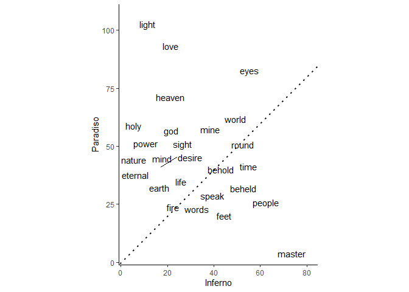
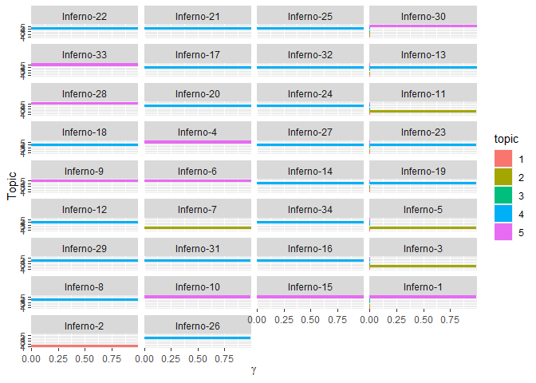

Text analysis
================

## Learning objectives

-   understand how to ‘tidy’ text
-   able to run some basic analysis e.g. term frequencies
-   familiar with basics of topic modelling

## Data

We’ll be exploring a translation of [Dante’s *Divine
Comedy*](https://www.gutenberg.org/cache/epub/1004/pg1004-images.html).
Written in the early 1300s, the *Commedia* is broken down into three
divisions: *Inferno*, *Purgatorio* and *Paradiso*).


## Setup

``` r
library(tidyverse)
library(tidytext)
```

## Read text

``` r
raw_text <- read_csv("data/commedia.csv")
```

    ## Rows: 14241 Columns: 4
    ## -- Column specification -------------------------------------------------------
    ## Delimiter: ","
    ## chr (2): text, cantica
    ## dbl (2): canto, line
    ## 
    ## i Use `spec()` to retrieve the full column specification for this data.
    ## i Specify the column types or set `show_col_types = FALSE` to quiet this message.

``` r
glimpse(raw_text)
```

    ## Rows: 14,241
    ## Columns: 4
    ## $ text    <chr> "Midway upon the journey of our life", "I found myself within~
    ## $ cantica <chr> "Inferno", "Inferno", "Inferno", "Inferno", "Inferno", "Infer~
    ## $ canto   <dbl> 1, 1, 1, 1, 1, 1, 1, 1, 1, 1, 1, 1, 1, 1, 1, 1, 1, 1, 1, 1, 1~
    ## $ line    <dbl> 1, 2, 3, 4, 5, 6, 7, 8, 9, 10, 11, 12, 13, 14, 15, 16, 17, 18~

## Tidy text

*Structure text into one word per row*

### Tokenise

Convert text into tokens (e.g. characters, words, n-grams, and tweets)

``` r
tidy_text <- raw_text %>% 
  unnest_tokens(output = word, input = text) 
tidy_text
```

    ## # A tibble: 111,288 x 4
    ##    cantica canto  line word   
    ##    <chr>   <dbl> <dbl> <chr>  
    ##  1 Inferno     1     1 midway 
    ##  2 Inferno     1     1 upon   
    ##  3 Inferno     1     1 the    
    ##  4 Inferno     1     1 journey
    ##  5 Inferno     1     1 of     
    ##  6 Inferno     1     1 our    
    ##  7 Inferno     1     1 life   
    ##  8 Inferno     1     2 i      
    ##  9 Inferno     1     2 found  
    ## 10 Inferno     1     2 myself 
    ## # i 111,278 more rows

### Stop words

Remove common words like ‘and’ and ‘the’

``` r
stop_words
```

    ## # A tibble: 1,161 x 2
    ##    word        lexicon
    ##    <chr>       <chr>  
    ##  1 a           SMART  
    ##  2 a's         SMART  
    ##  3 able        SMART  
    ##  4 about       SMART  
    ##  5 above       SMART  
    ##  6 according   SMART  
    ##  7 accordingly SMART  
    ##  8 across      SMART  
    ##  9 actually    SMART  
    ## 10 after       SMART  
    ## # i 1,151 more rows

``` r
other_stop_words <- tibble(word = c("thou", "thee", "thy", "doth", "o", "thus"))
other_stop_words
```

    ## # A tibble: 6 x 1
    ##   word 
    ##   <chr>
    ## 1 thou 
    ## 2 thee 
    ## 3 thy  
    ## 4 doth 
    ## 5 o    
    ## 6 thus

``` r
stop_words <- bind_rows(stop_words, other_stop_words)
tidy_text <- tidy_text %>% 
  anti_join(stop_words, by = "word")
tidy_text
```

    ## # A tibble: 37,187 x 4
    ##    cantica canto  line word           
    ##    <chr>   <dbl> <dbl> <chr>          
    ##  1 Inferno     1     1 midway         
    ##  2 Inferno     1     1 journey        
    ##  3 Inferno     1     1 life           
    ##  4 Inferno     1     2 found          
    ##  5 Inferno     1     2 forest         
    ##  6 Inferno     1     2 dark           
    ##  7 Inferno     1     3 straightforward
    ##  8 Inferno     1     3 pathway        
    ##  9 Inferno     1     3 lost           
    ## 10 Inferno     1     4 ah             
    ## # i 37,177 more rows

### Word stemming and lemmatization

Reduce words to simpler forms

``` r
library(SnowballC) ; library(textstem)
tidy_text %>%
  sample_n(10) %>% 
  mutate(stem = wordStem(word),
         lemm = lemmatize_words(word))
```

    ## # A tibble: 10 x 6
    ##    cantica    canto  line word      stem    lemm    
    ##    <chr>      <dbl> <dbl> <chr>     <chr>   <chr>   
    ##  1 Purgatorio     4    72 alas      ala     alas    
    ##  2 Inferno       31   112 advance   advanc  advance 
    ##  3 Paradiso      33    86 bound     bound   bind    
    ##  4 Paradiso      15    97 florence  florenc florence
    ##  5 Purgatorio    24    89 ere       er      ere     
    ##  6 Paradiso      14    68 arose     aros    arise   
    ##  7 Paradiso      31    71 crown     crown   crown   
    ##  8 Paradiso      15    99 quiet     quiet   quiet   
    ##  9 Purgatorio    30    83 te        te      te      
    ## 10 Inferno       11    38 marauders maraud  marauder

## Analysing text

### Term frequency

**Frequency of specific term**

``` r
tidy_text %>% 
  filter(str_detect(word, "grace")) %>% 
  group_by(cantica) %>% 
  count(word, sort = TRUE)
```

    ## # A tibble: 4 x 3
    ## # Groups:   cantica [3]
    ##   cantica    word       n
    ##   <chr>      <chr>  <int>
    ## 1 Paradiso   grace     43
    ## 2 Purgatorio grace     20
    ## 3 Inferno    grace      2
    ## 4 Purgatorio graces     1

**Most common terms**

``` r
tidy_text %>% 
  count(cantica, word) %>% 
  slice_max(n, n = 10) %>% 
  pivot_wider(names_from = cantica, values_from = n)
```

    ## # A tibble: 10 x 4
    ##    word   Paradiso Purgatorio Inferno
    ##    <chr>     <int>      <int>   <int>
    ##  1 light       106         NA      NA
    ##  2 eyes         86         99      NA
    ##  3 love         90         NA      NA
    ##  4 master       NA         NA      81
    ##  5 heaven       68         NA      NA
    ##  6 world        65         NA      NA
    ##  7 art          NA         NA      62
    ##  8 holy         62         NA      NA
    ##  9 people       NA         NA      60
    ## 10 god          60         NA      NA

**Compare term frequencies between documents**

``` r
library(ggrepel)
tidy_text %>% 
  filter(cantica %in% c("Inferno", "Paradiso")) %>%
  count(cantica, word) %>%
  group_by(word) %>%
  filter(sum(n) > 50) %>%
  ungroup() %>%
  pivot_wider(names_from = "cantica", values_from = "n", values_fill = 0) %>%
  ggplot(aes(`Inferno`, `Paradiso`)) +
  geom_abline(linewidth = 1, alpha = 0.8, lty = 3) +
  geom_text_repel(aes(label = word)) +
  coord_fixed()
```

<!-- -->

**Term frequency - inverse document frequency**  
*Relative importance of a term in a document*

``` r
tidy_text %>% 
  count(cantica, word, sort = TRUE) %>% 
  bind_tf_idf(term = word, document = cantica, n = n) %>% 
  slice_max(tf_idf, n = 5)
```

    ## # A tibble: 5 x 6
    ##   cantica  word        n      tf   idf  tf_idf
    ##   <chr>    <chr>   <int>   <dbl> <dbl>   <dbl>
    ## 1 Inferno  crag       20 0.00163 1.10  0.00179
    ## 2 Inferno  moat       16 0.00130 1.10  0.00143
    ## 3 Inferno  boiling    13 0.00106 1.10  0.00116
    ## 4 Inferno  sand       13 0.00106 1.10  0.00116
    ## 5 Paradiso christ     33 0.00268 0.405 0.00109

### Sentiment analysis

``` r
get_sentiments("bing")
```

    ## # A tibble: 6,786 x 2
    ##    word        sentiment
    ##    <chr>       <chr>    
    ##  1 2-faces     negative 
    ##  2 abnormal    negative 
    ##  3 abolish     negative 
    ##  4 abominable  negative 
    ##  5 abominably  negative 
    ##  6 abominate   negative 
    ##  7 abomination negative 
    ##  8 abort       negative 
    ##  9 aborted     negative 
    ## 10 aborts      negative 
    ## # i 6,776 more rows

**Percentage of negative words**

``` r
tidy_text %>%
  inner_join(get_sentiments("bing")) %>%
  count(cantica, sentiment) %>%
  group_by(cantica) %>%
  mutate(percent = n / sum(n) * 100) %>%
  filter(sentiment == "negative") %>%
  arrange(desc(percent))
```

    ## Joining with `by = join_by(word)`

    ## Warning in inner_join(., get_sentiments("bing")): Detected an unexpected many-to-many relationship between `x` and `y`.
    ## i Row 841 of `x` matches multiple rows in `y`.
    ## i Row 2340 of `y` matches multiple rows in `x`.
    ## i If a many-to-many relationship is expected, set `relationship =
    ##   "many-to-many"` to silence this warning.

    ## # A tibble: 3 x 4
    ## # Groups:   cantica [3]
    ##   cantica    sentiment     n percent
    ##   <chr>      <chr>     <int>   <dbl>
    ## 1 Inferno    negative   1456    67.7
    ## 2 Purgatorio negative   1078    51.5
    ## 3 Paradiso   negative    713    32.7

**Most common negative and positive words**

``` r
tidy_text %>%
  inner_join(get_sentiments("bing")) %>%
  count(word, sentiment) %>%
  group_by(sentiment) %>%
  slice_max(n, n = 10) %>%
  ungroup() %>%
  ggplot(aes(n, fct_reorder(word, n), fill = sentiment)) +
  geom_col(show.legend = FALSE) +
  facet_wrap(~ sentiment, scales = "free")
```

    ## Joining with `by = join_by(word)`

    ## Warning in inner_join(., get_sentiments("bing")): Detected an unexpected many-to-many relationship between `x` and `y`.
    ## i Row 841 of `x` matches multiple rows in `y`.
    ## i Row 2340 of `y` matches multiple rows in `x`.
    ## i If a many-to-many relationship is expected, set `relationship =
    ##   "many-to-many"` to silence this warning.

<!-- -->

**Change in sentiment**

``` r
tidy_text %>% 
  inner_join(get_sentiments("bing"), by = "word") %>% 
  group_by(cantica, canto) %>% 
  count(canto, sentiment) %>%
  pivot_wider(names_from = sentiment, values_from = n, values_fill = 0) %>% 
  mutate(sentiment = positive - negative) %>% 
  ggplot(aes(canto, sentiment, fill = cantica)) +
  geom_col(show.legend = FALSE) +
  facet_wrap(~factor(cantica, levels = c("Inferno","Purgatorio","Paradiso")), 
             scales = "free_x") +
  scale_x_continuous(expand = c(0, 0)) 
```

    ## Warning in inner_join(., get_sentiments("bing"), by = "word"): Detected an unexpected many-to-many relationship between `x` and `y`.
    ## i Row 841 of `x` matches multiple rows in `y`.
    ## i Row 2340 of `y` matches multiple rows in `x`.
    ## i If a many-to-many relationship is expected, set `relationship =
    ##   "many-to-many"` to silence this warning.

<!-- -->

### N-grams

``` r
raw_text %>% 
  unnest_tokens(bigram, text, token = "ngrams", n = 2) %>%
  separate(bigram, c("word1", "word2"), sep =" ") %>% 
  filter(!word1 %in% stop_words$word,
         !word2 %in% stop_words$word) %>%
  unite(bigram, word1, word2, sep = " ") %>% 
  count(cantica, bigram) %>%
  bind_tf_idf(bigram, cantica, n) %>%
  arrange(desc(tf_idf))
```

    ## # A tibble: 6,881 x 6
    ##    cantica    bigram             n      tf   idf  tf_idf
    ##    <chr>      <chr>          <int>   <dbl> <dbl>   <dbl>
    ##  1 Purgatorio sweet father       6 0.00241  1.10 0.00265
    ##  2 Paradiso   holy spirit        5 0.00210  1.10 0.00231
    ##  3 Inferno    mine ears          4 0.00168  1.10 0.00185
    ##  4 Inferno    weary souls        3 0.00126  1.10 0.00139
    ##  5 Paradiso   eternal light      3 0.00126  1.10 0.00139
    ##  6 Paradiso   grace divine       3 0.00126  1.10 0.00139
    ##  7 Paradiso   holy lights        3 0.00126  1.10 0.00139
    ##  8 Paradiso   human species      3 0.00126  1.10 0.00139
    ##  9 Paradiso   living hope        3 0.00126  1.10 0.00139
    ## 10 Paradiso   living justice     3 0.00126  1.10 0.00139
    ## # i 6,871 more rows

### Topic modelling

**Train topic model**

``` r
dtm <- tidy_text %>%
  mutate(canto = as.integer(as.roman(canto))) %>%
  unite(canto, cantica, canto, sep = "-") %>% 
  count(canto, word, sort = TRUE) %>% # each canto is a document
  cast_sparse(row = canto, column = word, value = n) # cast into a document term matrix 
dim(dtm)
```

    ## [1]  100 9216

**Create topic model**

``` r
library(stm)
topic_model <- stm(dtm, K = 3)
```

    ## Beginning Spectral Initialization 
    ##   Calculating the gram matrix...
    ##   Finding anchor words...
    ##      ...
    ##   Recovering initialization...
    ##      ............................................................................................
    ## Initialization complete.
    ## ....................................................................................................
    ## Completed E-Step (0 seconds). 
    ## Completed M-Step. 
    ## Completing Iteration 1 (approx. per word bound = -8.168) 
    ## ....................................................................................................
    ## Completed E-Step (0 seconds). 
    ## Completed M-Step. 
    ## Completing Iteration 2 (approx. per word bound = -7.906, relative change = 3.214e-02) 
    ## ....................................................................................................
    ## Completed E-Step (0 seconds). 
    ## Completed M-Step. 
    ## Completing Iteration 3 (approx. per word bound = -7.882, relative change = 2.966e-03) 
    ## ....................................................................................................
    ## Completed E-Step (0 seconds). 
    ## Completed M-Step. 
    ## Completing Iteration 4 (approx. per word bound = -7.880, relative change = 3.219e-04) 
    ## ....................................................................................................
    ## Completed E-Step (0 seconds). 
    ## Completed M-Step. 
    ## Completing Iteration 5 (approx. per word bound = -7.879, relative change = 1.356e-04) 
    ## Topic 1: eyes, love, heaven, world, light 
    ##  Topic 2: master, art, people, eyes, time 
    ##  Topic 3: eyes, light, love, mine, heaven 
    ## ....................................................................................................
    ## Completed E-Step (0 seconds). 
    ## Completed M-Step. 
    ## Completing Iteration 6 (approx. per word bound = -7.878, relative change = 6.485e-05) 
    ## ....................................................................................................
    ## Completed E-Step (0 seconds). 
    ## Completed M-Step. 
    ## Completing Iteration 7 (approx. per word bound = -7.878, relative change = 4.391e-05) 
    ## ....................................................................................................
    ## Completed E-Step (0 seconds). 
    ## Completed M-Step. 
    ## Completing Iteration 8 (approx. per word bound = -7.877, relative change = 3.095e-05) 
    ## ....................................................................................................
    ## Completed E-Step (0 seconds). 
    ## Completed M-Step. 
    ## Completing Iteration 9 (approx. per word bound = -7.877, relative change = 1.251e-05) 
    ## ....................................................................................................
    ## Completed E-Step (0 seconds). 
    ## Completed M-Step. 
    ## Model Converged

``` r
summary(topic_model)
```

    ## A topic model with 3 topics, 100 documents and a 9216 word dictionary.

    ## Topic 1 Top Words:
    ##       Highest Prob: eyes, love, heaven, world, light, round, sight 
    ##       FREX: truth, star, virtue, substances, swift, lights, wheels 
    ##       Lift: proclaim, paul, evidence, proofs, weal, excused, addressed 
    ##       Score: anxiety, substances, followeth, splendour, surpassed, founded, loves 
    ## Topic 2 Top Words:
    ##       Highest Prob: master, art, people, eyes, time, round, world 
    ##       FREX: boiling, pitch, master, serpents, doleful, tower, cried 
    ##       Lift: boiling, pitch, achieved, chiron, fraud, centaur, bush 
    ##       Score: afflicteth, boiling, pitch, moat, crag, hair, serpents 
    ## Topic 3 Top Words:
    ##       Highest Prob: eyes, light, love, mine, god, heaven, sun 
    ##       FREX: grace, christ, virgilius, light, eternal, day, ardour 
    ##       Lift: sacrifice, vigour, penitence, conscious, ting, fattens, scorned 
    ##       Score: accident, effulgence, vigour, ardour, sacrifice, penitence, splendour

**Topic-word probabilities**  
*For each topic what is the probability that we get each of these words*

``` r
word_topics <- tidy(topic_model, matrix = "beta")

word_topics %>% 
  group_by(topic) %>% 
  slice_max(beta, n = 10) %>% 
  ungroup() %>% 
  mutate(topic = paste("Topic", topic)) %>% 
  ggplot(aes(beta, reorder_within(term, beta, topic), fill = topic)) +
  geom_col(show.legend = FALSE) +
  facet_wrap(~topic, scale = "free_y") +
  scale_y_reordered() +
  labs(x = expression(beta), y = NULL)
```

<!-- -->

**Document-topic probabilities**  
*For each topic and document what is the probability of that document
being generated from that topic*

``` r
song_topics <- tidy(topic_model, matrix = "gamma", document_names = rownames(dtm))  

song_topics %>%
  filter(str_detect(document, "Inferno")) %>% # choose cantica
  mutate(song_name = fct_reorder(document, gamma),
         topic = factor(topic)) %>%
  ggplot(aes(gamma, topic, fill = topic)) +
  geom_col(show.legend = FALSE) +
  facet_wrap(vars(song_name), ncol = 4) +
  scale_x_continuous(expand = c(0, 0)) +
  labs(x = expression(gamma), y = "Topic")
```

<!-- -->

## Further resources

-   Silge, J., and Robinson, D. 2017. [Text Mining with R: A Tidy
    Approach](https://www.tidytextmining.com). Sebastopol: O’Reilly
    Media, Inc. 
-   Hvitfeldt, E. and Silge, J. 2021. [Supervised Machine Learning for
    Text Analysis in R](https://smltar.com/). New York: Chapman and
    Hall/CRC.
