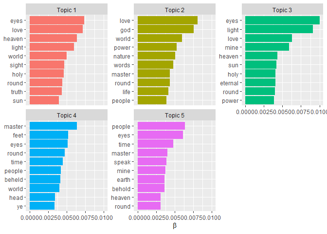

Text analysis
================

## Learning objectives

-   understand how to ‘tidy’ text
-   able to run some basic analysis e.g. term frequencies
-   familiar with basics of topic modelling

## Data

We’ll be exploring a translation of [Dante’s *Divine
Comedy*](https://www.gutenberg.org/cache/epub/1004/pg1004-images.html).
Written in the early 1300s, the *Commedia* is broken down into three
divisions: *Inferno*, *Purgatorio* and *Paradiso*).


## Setup

``` r
library(tidyverse)
```

## Read text

``` r
raw_text <- read_csv("data/commedia.csv")
```

    ## Rows: 14241 Columns: 4
    ## -- Column specification -----------------------------
    ## Delimiter: ","
    ## chr (2): text, cantica
    ## dbl (2): canto, line
    ##
    ## i Use `spec()` to retrieve the full column specification for this data.
    ## i Specify the column types or set `show_col_types = FALSE` to quiet this message.

## Inspect text

``` r
glimpse(raw_text)
```

    ## Rows: 14,241
    ## Columns: 4
    ## $ text    <chr> "Midway upon the journey of our lif~
    ## $ cantica <chr> "Inferno", "Inferno", "Inferno", "I~
    ## $ canto   <dbl> 1, 1, 1, 1, 1, 1, 1, 1, 1, 1, 1, 1,~
    ## $ line    <dbl> 1, 2, 3, 4, 5, 6, 7, 8, 9, 10, 11, ~

``` r
raw_text %>%
  group_by(cantica) %>%
  summarise(n = n_distinct(canto))
```

    ## # A tibble: 3 x 2
    ##   cantica        n
    ##   <chr>      <int>
    ## 1 Inferno       34
    ## 2 Paradiso      33
    ## 3 Purgatorio    33

## Tidy text

*Structure text into one word per row*

### Tokenise

Convert text into tokens (e.g. characters, words, n-grams, and tweets)

``` r
library(tidytext)
tidy_text <- raw_text %>%
  unnest_tokens(output = word, input = text)
tidy_text
```

    ## # A tibble: 111,288 x 4
    ##    cantica canto  line word   
    ##    <chr>   <dbl> <dbl> <chr>  
    ##  1 Inferno     1     1 midway
    ##  2 Inferno     1     1 upon   
    ##  3 Inferno     1     1 the    
    ##  4 Inferno     1     1 journey
    ##  5 Inferno     1     1 of     
    ##  6 Inferno     1     1 our    
    ##  7 Inferno     1     1 life   
    ##  8 Inferno     1     2 i      
    ##  9 Inferno     1     2 found  
    ## 10 Inferno     1     2 myself
    ## # i 111,278 more rows

### Stop words

Remove common words like ‘and’ and ‘the’

``` r
stop_words
```

    ## # A tibble: 1,171 x 2
    ##    word        lexicon
    ##    <chr>       <chr>  
    ##  1 a           SMART  
    ##  2 a's         SMART  
    ##  3 able        SMART  
    ##  4 about       SMART  
    ##  5 above       SMART  
    ##  6 according   SMART  
    ##  7 accordingly SMART  
    ##  8 across      SMART  
    ##  9 actually    SMART  
    ## 10 after       SMART  
    ## # i 1,161 more rows

``` r
other_stop_words <- tibble(word = c("ah","art","dost","doth","hast","shalt","thou","thee","thy","thine","thus"))
other_stop_words
```

    ## # A tibble: 11 x 1
    ##    word
    ##    <chr>
    ##  1 ah   
    ##  2 art  
    ##  3 dost
    ##  4 doth
    ##  5 hast
    ##  6 shalt
    ##  7 thou
    ##  8 thee
    ##  9 thy  
    ## 10 thine
    ## 11 thus

``` r
stop_words <- bind_rows(stop_words, other_stop_words)
tidy_text <- tidy_text %>%
  anti_join(stop_words, by = "word")
tidy_text
```

    ## # A tibble: 36,663 x 4
    ##    cantica canto  line word           
    ##    <chr>   <dbl> <dbl> <chr>          
    ##  1 Inferno     1     1 midway         
    ##  2 Inferno     1     1 journey        
    ##  3 Inferno     1     1 life           
    ##  4 Inferno     1     2 found          
    ##  5 Inferno     1     2 forest         
    ##  6 Inferno     1     2 dark           
    ##  7 Inferno     1     3 straightforward
    ##  8 Inferno     1     3 pathway        
    ##  9 Inferno     1     3 lost           
    ## 10 Inferno     1     4 hard           
    ## # i 36,653 more rows

### Word stemming and lemmatization

Reduce words to simpler forms

``` r
library(SnowballC) ; library(textstem)
tidy_text %>%
  sample_n(10) %>%
  mutate(stem = wordStem(word),
         lemm = lemmatize_words(word))
```

    ## # A tibble: 10 x 6
    ##    cantica    canto  line word          stem    lemm
    ##    <chr>      <dbl> <dbl> <chr>         <chr>   <chr>
    ##  1 Paradiso      27   107 moves         move    move
    ##  2 Inferno        3     8 eterne        etern   eter~
    ##  3 Paradiso      10   137 reading       read    read
    ##  4 Paradiso       9    83 forthwith     forthw~ fort~
    ##  5 Purgatorio    22   147 understanding unders~ unde~
    ##  6 Paradiso       2     1 boat          boat    boat
    ##  7 Purgatorio    12   133 fingers       finger  fing~
    ##  8 Paradiso      31    88 preserve      preserv pres~
    ##  9 Paradiso      21    81 whirling      whirl   whirl
    ## 10 Inferno       29    53 left          left    leave

## Analysing text

### Term frequency

**Frequency of specific term**

``` r
tidy_text %>%
  filter(str_detect(word, "(?i)grace")) %>%
  group_by(cantica) %>%
  count(word, sort = TRUE)
```

    ## # A tibble: 4 x 3
    ## # Groups:   cantica [3]
    ##   cantica    word       n
    ##   <chr>      <chr>  <int>
    ## 1 Paradiso   grace     43
    ## 2 Purgatorio grace     20
    ## 3 Inferno    grace      2
    ## 4 Purgatorio graces     1

**Most common terms**

``` r
tidy_text %>%
  count(cantica, word) %>%
  slice_max(n, n = 10) %>%
  pivot_wider(names_from = cantica, values_from = n)
```

    ## # A tibble: 9 x 4
    ##   word   Paradiso Purgatorio Inferno
    ##   <chr>     <int>      <int>   <int>
    ## 1 light       106         NA      NA
    ## 2 eyes         86         99      NA
    ## 3 love         90         NA      NA
    ## 4 master       NA         NA      81
    ## 5 heaven       68         NA      NA
    ## 6 world        65         NA      NA
    ## 7 holy         62         NA      NA
    ## 8 people       NA         NA      60
    ## 9 god          60         NA      NA

**Compare term frequencies between documents**

``` r
library(ggrepel)
tidy_text %>%
  filter(cantica %in% c("Inferno", "Paradiso")) %>%
  count(cantica, word) %>%
  group_by(word) %>%
  filter(sum(n) > 50) %>%
  ungroup() %>%
  pivot_wider(names_from = "cantica", values_from = "n", values_fill = 0) %>%
  ggplot(aes(`Inferno`, `Paradiso`)) +
  geom_abline(linewidth = 1, alpha = 0.8, lty = 3) +
  geom_text_repel(aes(label = word)) +
  coord_fixed() +
  theme_classic()
```

<!-- -->

**Term frequency - inverse document frequency**  
*Relative importance of a term in a document*

``` r
tidy_text %>%
  count(cantica, word, sort = TRUE) %>%
  bind_tf_idf(term = word, document = cantica, n = n) %>%
  slice_max(tf_idf, n = 10)
```

    ## # A tibble: 10 x 6
    ##    cantica  word         n       tf   idf   tf_idf
    ##    <chr>    <chr>    <int>    <dbl> <dbl>    <dbl>
    ##  1 Inferno  crag        20 0.00165  1.10  0.00182
    ##  2 Inferno  moat        16 0.00132  1.10  0.00145
    ##  3 Inferno  boiling     13 0.00108  1.10  0.00118
    ##  4 Inferno  sand        13 0.00108  1.10  0.00118
    ##  5 Paradiso christ      33 0.00271  0.405 0.00110
    ##  6 Inferno  bolgia      10 0.000827 1.10  0.000908
    ##  7 Inferno  pitch       10 0.000827 1.10  0.000908
    ##  8 Paradiso gladness    10 0.000822 1.10  0.000903
    ##  9 Paradiso standard     9 0.000740 1.10  0.000813
    ## 10 Inferno  cried       24 0.00198  0.405 0.000805

### Sentiment analysis

``` r
get_sentiments("bing")
```

    ## # A tibble: 6,786 x 2
    ##    word        sentiment
    ##    <chr>       <chr>    
    ##  1 2-faces     negative
    ##  2 abnormal    negative
    ##  3 abolish     negative
    ##  4 abominable  negative
    ##  5 abominably  negative
    ##  6 abominate   negative
    ##  7 abomination negative
    ##  8 abort       negative
    ##  9 aborted     negative
    ## 10 aborts      negative
    ## # i 6,776 more rows

**Percentage of negative words**

``` r
tidy_text %>%
  inner_join(get_sentiments("bing"), relationship = "many-to-many") %>%
  count(cantica, sentiment) %>%
  group_by(cantica) %>%
  mutate(percent = n / sum(n) * 100) %>%
  filter(sentiment == "negative") %>%
  arrange(desc(percent))
```

    ## Joining with `by = join_by(word)`

    ## # A tibble: 3 x 4
    ## # Groups:   cantica [3]
    ##   cantica    sentiment     n percent
    ##   <chr>      <chr>     <int>   <dbl>
    ## 1 Inferno    negative   1456    67.7
    ## 2 Purgatorio negative   1078    51.5
    ## 3 Paradiso   negative    713    32.7

**Most common negative and positive words**

``` r
tidy_text %>%
  inner_join(get_sentiments("bing"), relationship = "many-to-many") %>%
  count(word, sentiment) %>%
  group_by(sentiment) %>%
  slice_max(n, n = 10) %>%
  ungroup() %>%
  ggplot(aes(n, fct_reorder(word, n), fill = sentiment)) +
  geom_col(show.legend = FALSE) +
  facet_wrap(~ sentiment, scales = "free")
```

    ## Joining with `by = join_by(word)`

<!-- -->

**Change in sentiment**

``` r
tidy_text %>%
  inner_join(get_sentiments("bing"), by = "word", relationship = "many-to-many") %>%
  group_by(cantica, canto) %>%
  count(canto, sentiment) %>%
  pivot_wider(names_from = sentiment, values_from = n, values_fill = 0) %>%
  mutate(sentiment = positive - negative) %>%
  ggplot(aes(canto, sentiment, fill = cantica)) +
  geom_col(show.legend = FALSE) +
  geom_hline(yintercept = 0, size = 1, colour = "#212121") +
  facet_wrap(~factor(cantica, levels = c("Inferno","Purgatorio","Paradiso")),
             scales = "free_x") +
  scale_x_continuous(expand = c(0, 0)) +
  theme_classic()
```

<!-- -->

### N-grams

``` r
raw_text %>%
  unnest_tokens(bigram, text, token = "ngrams", n = 2) %>%
  separate(bigram, c("word1", "word2"), sep =" ") %>%
  filter(!word1 %in% stop_words$word,
         !word2 %in% stop_words$word) %>%
  unite(bigram, word1, word2, sep = " ") %>%
  count(cantica, bigram) %>%
  bind_tf_idf(bigram, cantica, n) %>%
  arrange(desc(tf_idf))
```

    ## # A tibble: 6,671 x 6
    ##    cantica    bigram          n      tf   idf  tf_idf
    ##    <chr>      <chr>       <int>   <dbl> <dbl>   <dbl>
    ##  1 Purgatorio sweet fath~     6 0.00250  1.10 0.00275
    ##  2 Paradiso   holy spirit     5 0.00217  1.10 0.00238
    ##  3 Inferno    mine ears       4 0.00175  1.10 0.00192
    ##  4 Inferno    weary souls     3 0.00131  1.10 0.00144
    ##  5 Paradiso   eternal li~     3 0.00130  1.10 0.00143
    ##  6 Paradiso   grace divi~     3 0.00130  1.10 0.00143
    ##  7 Paradiso   holy lights     3 0.00130  1.10 0.00143
    ##  8 Paradiso   human spec~     3 0.00130  1.10 0.00143
    ##  9 Paradiso   living hope     3 0.00130  1.10 0.00143
    ## 10 Paradiso   living jus~     3 0.00130  1.10 0.00143
    ## # i 6,661 more rows

### Topic modelling

**Train topic model**

``` r
dtm <- tidy_text %>%
  mutate(canto = as.integer(as.roman(canto))) %>%
  unite(canto, cantica, canto, sep = "-") %>%
  count(canto, word, sort = TRUE) %>% # each canto is a document
  cast_sparse(row = canto, column = word, value = n) # cast into a document term matrix
dim(dtm)
```

    ## [1]  100 9210

**Create topic model**

``` r
library(stm)
topic_model <- stm(dtm, K = 5)
```

    ## Beginning Spectral Initialization
    ##   Calculating the gram matrix...
    ##   Finding anchor words...
    ##      .....
    ##   Recovering initialization...
    ##      ............................................................................................
    ## Initialization complete.
    ## ....................................................................................................
    ## Completed E-Step (0 seconds).
    ## Completed M-Step.
    ## Completing Iteration 1 (approx. per word bound = -8.129)
    ## ....................................................................................................
    ## Completed E-Step (0 seconds).
    ## Completed M-Step.
    ## Completing Iteration 2 (approx. per word bound = -7.721, relative change = 5.023e-02)
    ## ....................................................................................................
    ## Completed E-Step (0 seconds).
    ## Completed M-Step.
    ## Completing Iteration 3 (approx. per word bound = -7.691, relative change = 3.902e-03)
    ## ....................................................................................................
    ## Completed E-Step (0 seconds).
    ## Completed M-Step.
    ## Completing Iteration 4 (approx. per word bound = -7.686, relative change = 6.083e-04)
    ## ....................................................................................................
    ## Completed E-Step (0 seconds).
    ## Completed M-Step.
    ## Completing Iteration 5 (approx. per word bound = -7.684, relative change = 2.418e-04)
    ## Topic 1: eyes, love, heaven, light, world
    ##  Topic 2: love, god, world, power, nature
    ##  Topic 3: eyes, light, love, mine, heaven
    ##  Topic 4: master, eyes, feet, round, time
    ##  Topic 5: people, eyes, time, master, speak
    ## ....................................................................................................
    ## Completed E-Step (0 seconds).
    ## Completed M-Step.
    ## Completing Iteration 6 (approx. per word bound = -7.684, relative change = 8.792e-05)
    ## ....................................................................................................
    ## Completed E-Step (0 seconds).
    ## Completed M-Step.
    ## Completing Iteration 7 (approx. per word bound = -7.683, relative change = 4.437e-05)
    ## ....................................................................................................
    ## Completed E-Step (0 seconds).
    ## Completed M-Step.
    ## Completing Iteration 8 (approx. per word bound = -7.683, relative change = 3.292e-05)
    ## ....................................................................................................
    ## Completed E-Step (0 seconds).
    ## Completed M-Step.
    ## Completing Iteration 9 (approx. per word bound = -7.683, relative change = 3.171e-05)
    ## ....................................................................................................
    ## Completed E-Step (0 seconds).
    ## Completed M-Step.
    ## Completing Iteration 10 (approx. per word bound = -7.683, relative change = 2.594e-05)
    ## Topic 1: eyes, love, heaven, light, world
    ##  Topic 2: love, god, world, power, nature
    ##  Topic 3: eyes, light, love, mine, heaven
    ##  Topic 4: master, feet, eyes, round, time
    ##  Topic 5: people, eyes, time, master, speak
    ## ....................................................................................................
    ## Completed E-Step (0 seconds).
    ## Completed M-Step.
    ## Completing Iteration 11 (approx. per word bound = -7.683, relative change = 1.786e-05)
    ## ....................................................................................................
    ## Completed E-Step (0 seconds).
    ## Completed M-Step.
    ## Model Converged

``` r
summary(topic_model)
```

    ## A topic model with 5 topics, 100 documents and a 9210 word dictionary.

    ## Topic 1 Top Words:
    ##       Highest Prob: eyes, love, heaven, light, world, sight, holy
    ##       FREX: truth, virtue, star, burning, holy, lights, contemplate
    ##       Lift: vus, ting, contingencies, distinction, necesse, proclaim, inlaid
    ##       Score: anxiety, substances, contemplate, beatrice, followeth, splendour, equally
    ## Topic 2 Top Words:
    ##       Highest Prob: love, god, world, power, nature, words, master
    ##       FREX: discern, nature, knoweth, god, heavens, standard, justice
    ##       Lift: achieved, charon, gherardo, conquers, afflicteth, anastasius, arson
    ##       Score: afflicteth, achieved, sincere, gherardo, charon, conquers, standard
    ## Topic 3 Top Words:
    ##       Highest Prob: eyes, light, love, mine, heaven, sun, holy
    ##       FREX: christ, vision, light, beatrice, realm, lady, rays
    ##       Lift: sequence, sacrifice, vigour, venerable, magnificence, satisfies, lids
    ##       Score: accident, beatrice, vigour, christ, sacrifice, beauty, salvation
    ## Topic 4 Top Words:
    ##       Highest Prob: master, feet, eyes, round, time, people, beheld
    ##       FREX: crag, moat, bridge, hair, boiling, arms, sand
    ##       Lift: chiron, nessus, rinier, harpies, phlegethon, paws, moats
    ##       Score: alichino, moat, bridge, boiling, crag, pitch, bolgia
    ## Topic 5 Top Words:
    ##       Highest Prob: people, eyes, time, master, speak, mine, earth
    ##       FREX: wast, laden, heavy, wretched, onward, honour, guido
    ##       Lift: brunetto, saddle, reigns, aright, tombs, guilt, mahomet
    ##       Score: battered, wretched, tombs, cerberus, ancestors, companions, troy

**Topic-word probabilities**  
*For each topic what is the probability that we get each of these words*

``` r
word_topics <- tidy(topic_model, matrix = "beta")

word_topics %>%
  group_by(topic) %>%
  slice_max(beta, n = 10) %>%
  ungroup() %>%
  mutate(topic = paste("Topic", topic)) %>%
  ggplot(aes(beta, reorder_within(term, beta, topic), fill = topic)) +
  geom_col(show.legend = FALSE) +
  facet_wrap(~topic, scale = "free_y") +
  scale_y_reordered() +
  labs(x = expression(beta), y = NULL)
```

<!-- -->

**Document-topic probabilities**  
*For each topic and document what is the probability of that document
(canto) being generated from that topic*

``` r
document_topics <- tidy(topic_model, matrix = "gamma", document_names = rownames(dtm))  

document_topics %>%
  filter(str_detect(document, "Inferno")) %>% # choose cantica
  mutate(document_name = fct_reorder(document, gamma),
         topic = factor(topic)) %>%
  ggplot(aes(gamma, topic, fill = topic)) +
  geom_col() +
  facet_wrap(vars(document_name), ncol = 4) +
  scale_x_continuous(expand = c(0, 0)) +
  labs(x = expression(gamma), y = "Topic")
```

<!-- -->

## Further resources

**Books**

-   Silge, J., and Robinson, D. 2017. [Text Mining with R: A Tidy
    Approach](https://www.tidytextmining.com). Sebastopol: O’Reilly
    Media, Inc. 
-   Hvitfeldt, E. and Silge, J. 2021. [Supervised Machine Learning for
    Text Analysis in R](https://smltar.com/). New York: Chapman and
    Hall/CRC.
-   Imai, K. and Webb Williams, N., 2022. [‘Textual Data’ in
    Quantitative Social Science: An Introduction in
    tidyverse](https://press.princeton.edu/books/paperback/9780691222288/quantitative-social-science)

**Tutorials**

-   [The game is afoot! Topic modeling of Sherlock Holmes
    stories](https://juliasilge.com/blog/sherlock-holmes-stm) by Julia
    Silge
-   [Topic modeling for \#TidyTuesday Spice Girls
    lyrics](https://juliasilge.com/blog/spice-girls/) by Julia Silge
