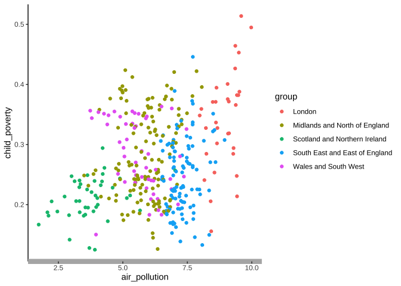
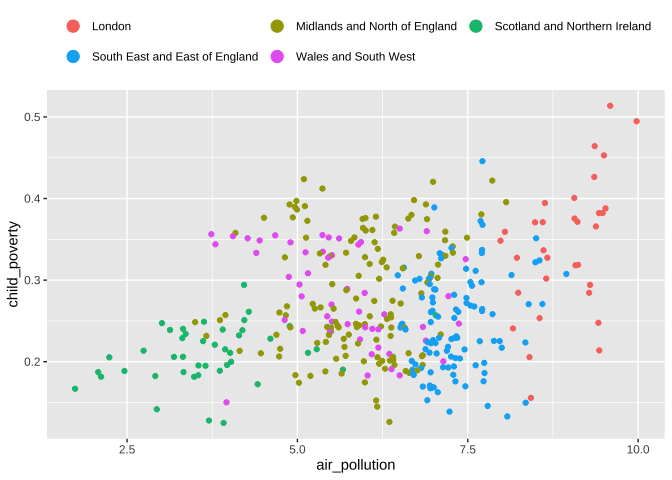

Visualising data with ggplot2
================
henrypartridge
2022-09-16

## Learning objectives

-   basic understanding of ‘grammar of graphics’  
-   able to create simple charts
-   adapt charts to the [ONS chart style
    guide](https://ons-design.notion.site/ONS-chart-style-guide-abc7605a97624dc2bc7f2a3e16379d82)

## Data

We’ll be comparing the percentage of children living in poverty by local
authority with levels of air pollution. Child poverty after housing
costs (2020/21) derive from [End Child
Poverty](http://endchildpoverty.org.uk/child-poverty) and
population-weighted annual mean PM2.5 concentrations (2020) are
published by [DEFRA](https://uk-air.defra.gov.uk/data/pcm-data).

## Setup

``` r
library(tidyverse)
```

    ## ── Attaching packages ──────────────────────────────────────────── tidyverse 1.3.0 ──

    ## ✓ ggplot2 3.3.6     ✓ purrr   0.3.4
    ## ✓ tibble  3.1.6     ✓ dplyr   1.0.8
    ## ✓ tidyr   1.2.0     ✓ stringr 1.4.0
    ## ✓ readr   1.4.0     ✓ forcats 0.5.1

    ## Warning: package 'tidyr' was built under R version 4.0.5

    ## Warning: package 'dplyr' was built under R version 4.0.5

    ## ── Conflicts ─────────────────────────────────────────────── tidyverse_conflicts() ──
    ## x dplyr::filter() masks stats::filter()
    ## x dplyr::lag()    masks stats::lag()

## Read data

``` r
df <- read_csv("data/child_poverty_and_pm25.csv")
```

    ## 
    ## ── Column specification ─────────────────────────────────────────────────────────────
    ## cols(
    ##   area_code = col_character(),
    ##   area_name = col_character(),
    ##   country_region = col_character(),
    ##   group = col_character(),
    ##   child_poverty = col_double(),
    ##   air_pollution = col_double()
    ## )

``` r
glimpse(df)
```

    ## Rows: 370
    ## Columns: 6
    ## $ area_code      <chr> "E09000030", "E09000025", "E09000002", "E09000012", "E060000…
    ## $ area_name      <chr> "Tower Hamlets", "Newham", "Barking and Dagenham", "Hackney"…
    ## $ country_region <chr> "London", "London", "London", "London", "East of England", "…
    ## $ group          <chr> "London", "London", "London", "London", "South East and East…
    ## $ child_poverty  <dbl> 0.5137, 0.4947, 0.4642, 0.4529, 0.4458, 0.4265, 0.4237, 0.42…
    ## $ air_pollution  <dbl> 9.5904, 9.9782, 9.3629, 9.4988, 7.7154, 9.3565, 5.0956, 7.85…

## ‘grammar of graphics’

The [ggplot2](https://ggplot2.tidyverse.org) package is underpinned by
the ‘**g**rammar of **g**raphics’ ([Wilkinson,
2005](https://link.springer.com/book/10.1007/0-387-28695-0)).
Essentially, every data visualisation has a formal structure with three
principle layers: data, aesthetics, and geometry. Variables in your
**data** are mapped to the **aes**thetic properties (e.g. position, size
and colour) of **geom**etric objects like scatter plots or line charts.
You can see this in the arguments used by ggplot2:

``` r
ggplot(data = df,                                        # data
  mapping = aes(x = var1, y = var2, colour = var3)) +    # aesthetics
  geom_point()                                           # geometry
```

## Chart types

**Bar chart**

``` r
df %>% 
  top_n(10, child_poverty) %>% 
  ggplot(aes(x = child_poverty, y = area_name)) +
  geom_col()
```

<!-- -->

``` r
df %>% 
  top_n(10, child_poverty) %>% 
  ggplot(aes(x = child_poverty, y = fct_reorder(area_name, child_poverty))) +
  geom_col(fill = "seagreen")
```

<!-- -->

**Choropleth map**

``` r
library(sf)
```

    ## Linking to GEOS 3.8.1, GDAL 3.1.4, PROJ 6.3.1

``` r
lad <- st_read("data/local_authority_districts.geojson")
```

    ## Reading layer `local_authority_districts' from data source `/Users/henrypartridge/Documents/GitHub/ddj/visualising-data-with-ggplot2/data/local_authority_districts.geojson' using driver `GeoJSON'
    ## Simple feature collection with 374 features and 1 field
    ## Geometry type: MULTIPOLYGON
    ## Dimension:     XY
    ## Bounding box:  xmin: -8.649996 ymin: 49.88234 xmax: 1.763571 ymax: 60.84568
    ## Geodetic CRS:  WGS 84

``` r
plot(st_geometry(lad))
```

<!-- -->

``` r
left_join(lad, df, by = "area_code") %>% 
  ggplot() +
  geom_sf(aes(fill = air_pollution), 
          colour = "#212121", size = 0.1) +
  scale_fill_distiller(palette = "Greys", direction = 1) +
  theme_void()
```

<!-- -->

**Scatter plot**

``` r
ggplot(df, aes(x = air_pollution, y = child_poverty, colour = group)) +
  geom_point()
```

<!-- -->

**Small multiples**

``` r
ggplot(df, aes(x = air_pollution, y = child_poverty, colour = group)) +
  geom_point() +
  facet_wrap(~group, nrow = 1)
```

<!-- -->

**Trend lines**

``` r
ggplot(df, aes(x = air_pollution, y = child_poverty, colour = group)) +
  geom_point() +
  geom_smooth(se = FALSE, method = "lm") +
  facet_wrap(~group, nrow = 1)
```

    ## `geom_smooth()` using formula 'y ~ x'

<!-- -->

## Create a chart template

``` r
gg <- ggplot(df, aes(air_pollution, child_poverty, colour = group)) +
  geom_point()
gg
```

<!-- -->

## Typography

``` r
gg +
  labs(x = "PM2.5 pollution levels",
       y = "Children living in poverty (%)",
       title = str_wrap("Children from low-income households are more likely to live in areas with high pollution", 50),
       subtitle = "UK local authorities, 2020",
       caption = "Source: End Child Poverty Coalition; DEFRA")
```

<!-- -->

``` r
library(showtext)
```

    ## Loading required package: sysfonts

    ## Loading required package: showtextdb

``` r
# font_families_google() 
font_add_google("Open Sans")
showtext_auto()

gg +
  labs(x = "PM2.5 pollution levels",
       y = "Children living in poverty (%)",
       title = str_wrap("Children from low-income households are more likely to live in areas with high pollution", 50),
       subtitle = "UK local authorities, 2020",
       caption = "Source: End Child Poverty Coalition; DEFRA") +
  theme(text = element_text(family = "Open Sans"))
```

<!-- -->

``` r
gg +
  labs(x = "PM2.5 pollution levels",
       y = "Children living in poverty (%)",
       title = str_wrap("Children from low-income households are more likely to live in areas with high pollution", 50),
       subtitle = "UK local authorities, 2020",
       caption = "Source: End Child Poverty Coalition; DEFRA") +
  theme(text = element_text(family = "Open Sans"),
        plot.title = element_text(face = "bold", colour = "red"),
        plot.caption = element_text(colour = "#707071", hjust = 0, 
                                    margin = margin(t = 10)))
```

<!-- -->

## Scales

**Axes**

``` r
library(scales)
```

    ## 
    ## Attaching package: 'scales'

    ## The following object is masked from 'package:purrr':
    ## 
    ##     discard

    ## The following object is masked from 'package:readr':
    ## 
    ##     col_factor

``` r
gg + scale_y_continuous(labels = percent_format(accuracy = 1),
                        limits = c(0,0.6))
```

<!-- -->

**Colours**

``` r
gg + 
  scale_colour_manual(values = c("#206095", "#27A0cc", "#871a5b", "#A8bd38", "#F66068"))
```

<!-- -->

``` r
gg +
  scale_colour_brewer(palette = "Set1")
```

<!-- -->

## Chart furniture

**Gridlines**

``` r
gg +
  theme_classic() +
  theme(axis.line.x = element_line(colour = "#B3B3B3", size = 3))
```

<!-- -->

**Legend**

``` r
gg + 
  labs(colour = NULL) +
  theme(legend.position = "top",
        legend.justification = "left",
        legend.key = element_blank()) +
  guides(colour = guide_legend(
    nrow = 2, byrow = TRUE,
    override.aes = list(size = 4)))
```

<!-- -->

**Annotations**

``` r
gg +
  theme_classic() +
  geom_vline(aes(xintercept = 5), colour = "#B3B3B3", linetype = "dashed", size = 0.8) +
  annotate("text", x = 5.2, y = 0.46, label = "WHO limit", angle = 90, size = 10)
```

<!-- -->

## Create a custom theme

``` r
theme_census <- function(){
  font <- "Open Sans"
  theme_classic() %+replace%
    
    theme(axis.title = element_text(colour = "#902082"),
          axis.text = element_text(colour = "#902082")
    )
}

gg +
  theme_census()
```

<!-- -->

## Highlighting

``` r
# library(gghighlight)
# gg +
#  gghighlight(group == "London", use_direct_label = F)
```

## Interactivity

``` r
# library(ggiraph)                               
# plot <- ggplot(df, aes(air_pollution, child_poverty, colour = group)) +
#   geom_point_interactive(aes(tooltip = area_name))
# girafe(ggobj = plot, width_svg = 6, height_svg = 6*0.618)
```

## Further resources

-   [ggplot2: Elegant Graphics for Data Analysis, 3rd
    edition](https://ggplot2-book.org) by Hadley Wickham et al.
-   [ggplot2 reference](https://ggplot2.tidyverse.org/reference/)
-   *R for Data Science* (Wickham & Grolemund) pages on [data
    visualization](https://r4ds.had.co.nz/data-visualisation.html)
-   [A ggplot2 Tutorial for Beautiful Plotting in
    R](https://www.cedricscherer.com/2019/08/05/a-ggplot2-tutorial-for-beautiful-plotting-in-r/)
    by Cédric Scherer
-   [BBC Visual and Data Journalism cookbook for R
    graphics](https://bbc.github.io/rcookbook/)
